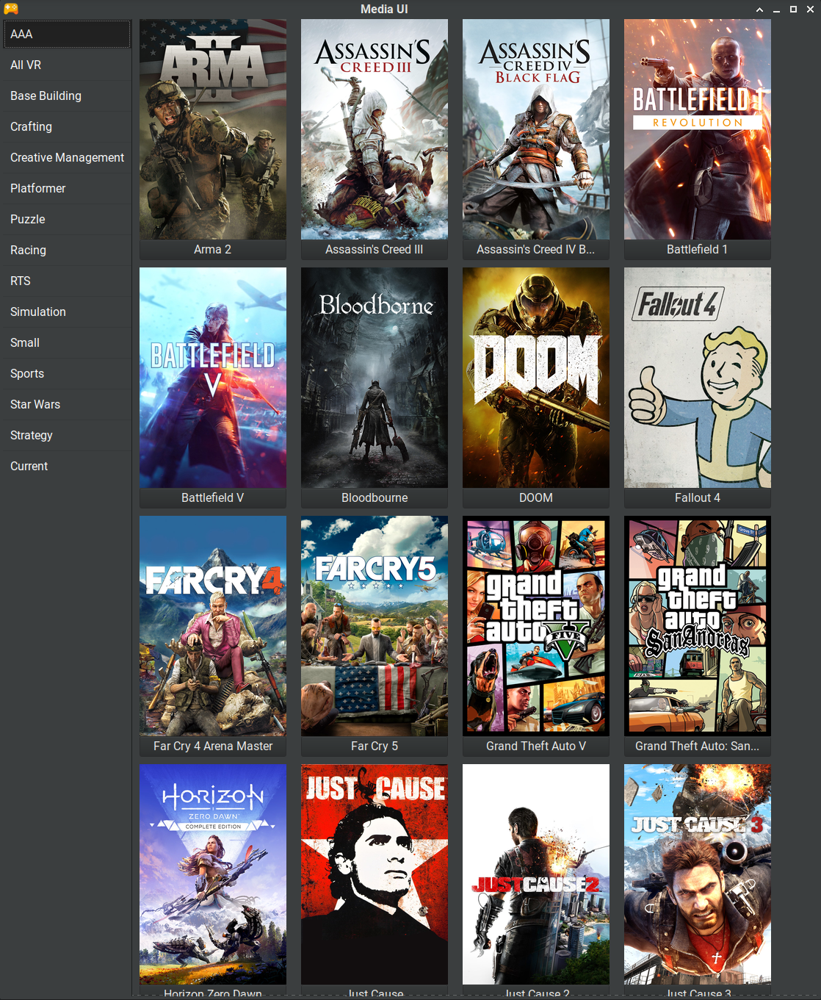

# Media UI


A program to display all the games you own, sorted by genre, and allows selecting certain games to be in a "Current" section to keep track of the games you are currently playing. 



To Do: 

* Tidy up code
* Remove some magic numbers (for example the size of some arrays)
* Add in support for mutliple types of media (e.g. Add option to pick between displaying games, music or movies)
* Add some more detail to the games (for example platform)

## Setup

### Installation 

Edit pathsAndStuff.h and choose the paths and values. The values are: 

`CURRENT_SAVE_PATH` = Path where the JSON representing the "Current" section should be saved (e.g. `.local/share/mediaUI/currentGames.json`)  
`ALL_GAMES_JSON_PATH` = Path where the JSON file containing all the games is located (e.g. `.local/share/mediaUI/allGames.json`)  
`COVER_ART_PATH` = Path where the cover art is located (e.g. `~/.local/share/mediaUI/coverArt/`)  
`COVER_ART_EXTENSION` = File extension of the cover art (e.g. `.png`)  
`NUM_GENRES` = Number of genres you have (not including "Current") (e.g. `14`)  
`MAX_CURRENT_GAMES` = Maximum number of games in the "Current" section (e.g. `50`)  
`MAX_GAMES_PER_GENRE` = Maximum number of games per genre (e.g. `50`)  

`make` - That's about it, dependancies are `json-c` and `gtk` but those are likely already installed

### Importing games 

The program works by reading a JSON file of all the games you have, organised by genre. The JSON file should be of the format: 
```json
{
	"genreName": {
		"gameName": {
			"info1": "info",
			"info2": "info"
		}
	}
}
```
The info isn't important, it's not used yet. Just the `genreName` and `gameName`. By default it expects up to 14 genres, and up to 71 games per genre. 

In the repository is a python script `convert.py`. This can be used to convert a markdown file of games into the required JSON file. The markdown file should be of the format:
```md
# Platform

## Medium (Disc/PSN etc)

### Genre

* Game 1
* Game 2
```
Usage: `convert.py input.md`

The cover art is expected to be all in one folder, with file names the same as the game name + ext.  
Basically all normal image formats are supported except webp.  
Recommended source: [SteamGridDB](https://www.steamgriddb.com/)

## Usage

`./gamesUI`

Click on the sidebar buttons to switch between genres. The "Current" tab can are the games you are currently playing/interested in. To add a game, click on it's button in a genre tab. To remove a game, click on it's button in the "Current" tab. 

`q` to quit, the "Current" tab will be saved to a JSON file and loaded in when the program is started next. 
